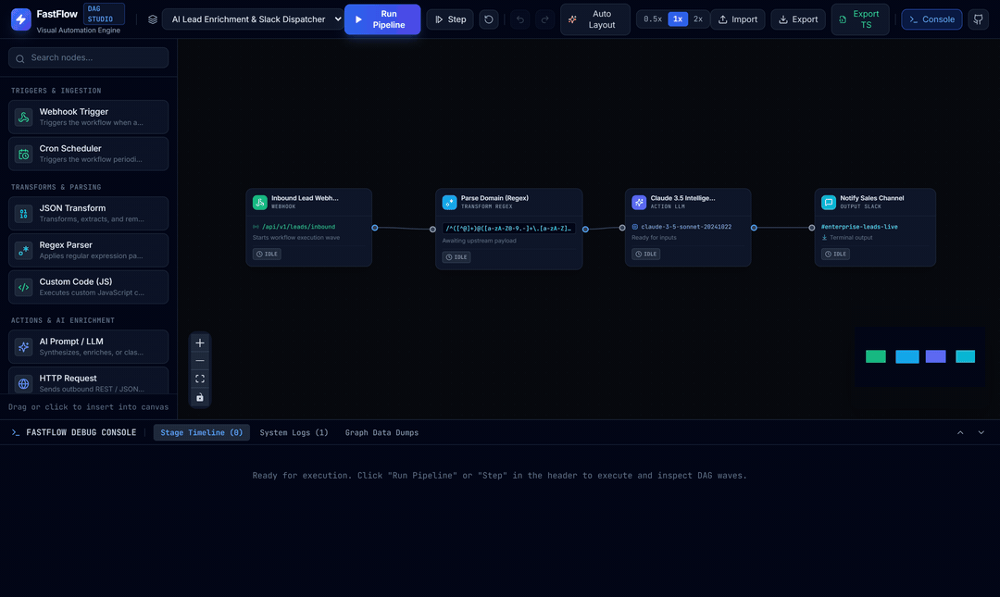
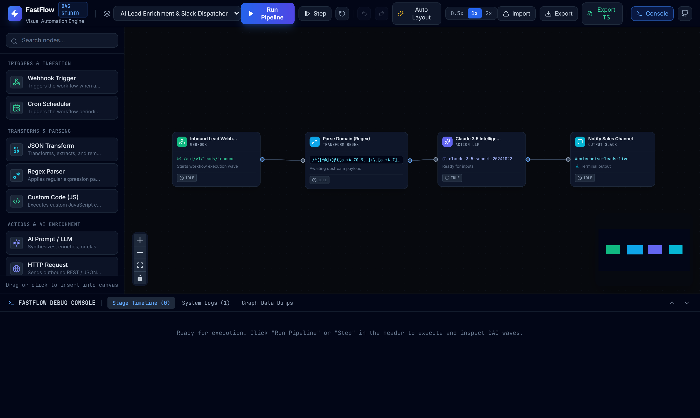
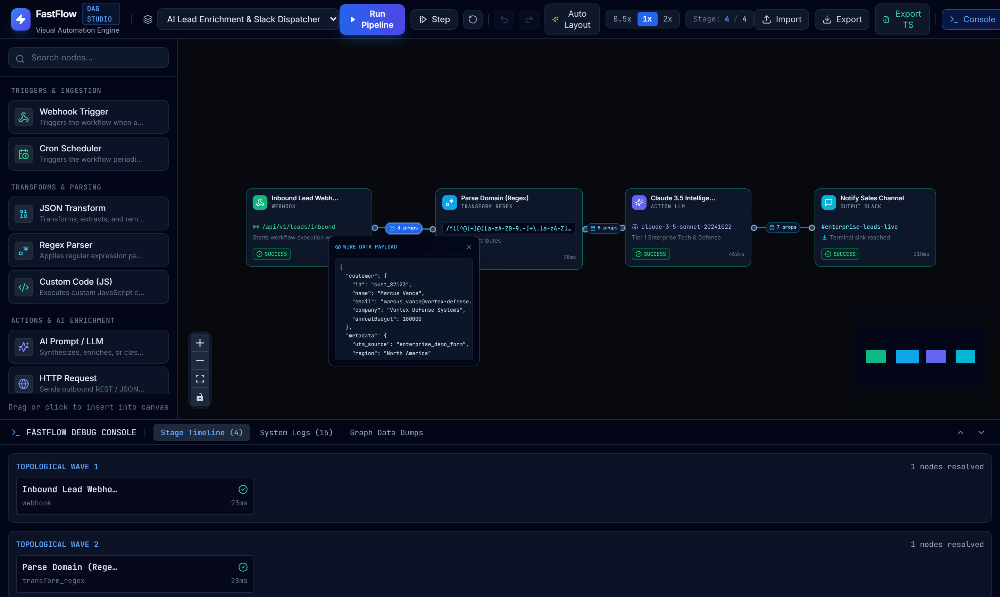
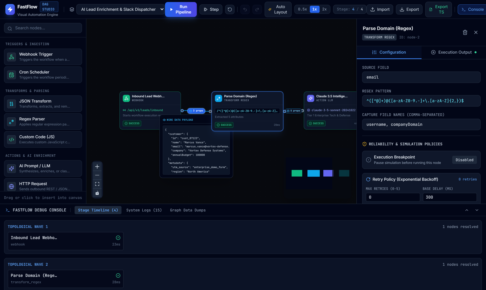

<p align="center">
  <a href="https://github.com/alexandrmotologa/fastflow">
    
  </a>
</p>

<h1 align="center">FastFlow</h1>

<p align="center">
  <strong>Client-side visual DAG workflow builder, cycle detector, and reactive execution engine.</strong>
</p>

<p align="center">
  <a href="#demo">Live Demo</a> •
  <a href="#features">Features</a> •
  <a href="#screenshots">Screenshots</a> •
  <a href="#node-types">Node Types</a> •
  <a href="#architecture">Architecture</a> •
  <a href="#getting-started">Getting Started</a>
</p>

---

FastFlow is a visual Directed Acyclic Graph (DAG) workflow builder and simulation engine that runs directly in the browser. It computes graph resolution, cycle detection, and step-by-step simulations on the client, with animated data conduits that show payloads moving between nodes in real time.

Most workflow orchestrators rely on backend queues, workers, and database transactions just to dry-run logic. FastFlow performs the complete topological resolution and pipeline simulation client-side using Kahn's algorithm and React Flow.

## Demo



## Features

- **Client-side DAG engine**: Resolves node execution order using Kahn's algorithm in O(V + E) time. Automatically detects cycles and partitions nodes into parallel execution waves.
- **Wire payload tooltips**: Each connection edge records transferred data during simulation. Hovering or clicking the edge pill opens an inspector showing the formatted JSON payload.
- **Breakpoints and wave stepping**: Click any node to set a breakpoint. The execution runner automatically pauses when reaching that node, allowing step-by-step inspection.
- **JavaScript sandbox code node**: Write custom JavaScript expressions with access to input payloads and execution context for complex transformations.
- **Dagre auto-layout**: One-click graph beautifier using the Dagre layout library to organize complex topologies into clean left-to-right pipelines.
- **Fault injection and retries**: Inject simulated upstream timeouts to test workflow resilience, configured with exponential backoff retry policies.
- **Inbound webhook presets**: Quick-load real-world inbound payloads from Stripe, GitHub, Shopify, and HubSpot.
- **Standalone TypeScript export**: Compiles any visual workflow into a zero-dependency, executable TypeScript script ready to run in Node.js via `tsx`.
- **Undo and redo history**: Revert or restore canvas edits with Ctrl+Z and Ctrl+Y keyboard shortcuts.
- **Execution console**: Inspect stage runtimes, system logs, and live JSON payloads for each node.

## Screenshots

### Studio Canvas & Topological Resolution
The main studio interface includes drag-and-drop node placement, real-time cycle detection warnings, and Dagre auto-layout.



### Wire Payload Inspector
Every connection edge records live data during execution. Clicking an edge badge opens an inline JSON inspector showing the exact payload transferred across that wire.



### Node Inspector & JavaScript Sandbox
Select any node to configure input schemas, write custom transformation scripts in a sandboxed JavaScript runtime, or configure timeout and retry policies with exponential backoff.



## Node types

The engine includes five node categories:

- **Triggers**: Webhook listeners (with Stripe, GitHub, Shopify, and HubSpot presets) and cron schedulers.
- **Transforms**: JSON field mappers, regular expression extractors, and custom JavaScript sandbox expressions.
- **Actions**: LLM prompts (Claude 3.5 Sonnet simulation) and outbound HTTP API requests.
- **Logic**: Conditional branches (if/else) with multi-handle output routing.
- **Outputs**: Slack notification dispatchers and PostgreSQL upsert statement generators.

## Technical stack

- **Framework**: React 18 with TypeScript and Vite
- **Graph canvas**: `@xyflow/react` (React Flow v12)
- **Graph layout**: `dagre`
- **State management**: Zustand
- **Styling**: Tailwind CSS
- **Icons**: Lucide React
- **Test suite**: Vitest

## Architecture

FastFlow separates the execution engine from the visual canvas:

1. **Graph resolution (`src/engine/dag_resolver.ts`)**: Calculates in-degrees for every node and builds an adjacency list. It pulls nodes with zero in-degrees into wave 0, decrements downstream neighbor degrees, and repeats until all nodes are ordered or a cycle is found. Includes Dagre integration for coordinate generation.
2. **Execution runner (`src/engine/execution_runner.ts`)**: Iterates through topological waves. Nodes within the same wave run concurrently via `Promise.allSettled`. Tracks breakpoints, handles retry policies with exponential backoff, records edge payloads, and reports progress callbacks.
3. **Reactive store (`src/store/useFlowStore.ts`)**: Connects React Flow graph updates, node selection, history stack for undo and redo, edge data cache, and debugger logs into a single reactive store.
4. **Code generation (`src/engine/codegen.ts`)**: Translates graph definitions, topological stages, and node configs into self-contained executable TypeScript code.
5. **Canvas components (`src/components/`)**: Renders custom node shells with status halos, interactive midpoint edge data badges, and animated SVG conduits.

## Getting started

### Prerequisites

Node.js 18 or higher.

### Installation

Clone the repository and install dependencies:

```bash
git clone https://github.com/alexandrmotologa/fastflow.git
cd fastflow
npm install
```

### Development server

Start the local development server:

```bash
npm run dev
```

Open your browser at `http://localhost:5233`.

### Running tests

Run the unit test suite:

```bash
npm test
```

### Production build

Compile the TypeScript code and generate static assets:

```bash
npm run build
```

## License

MIT License. See [LICENSE](LICENSE) for details.
